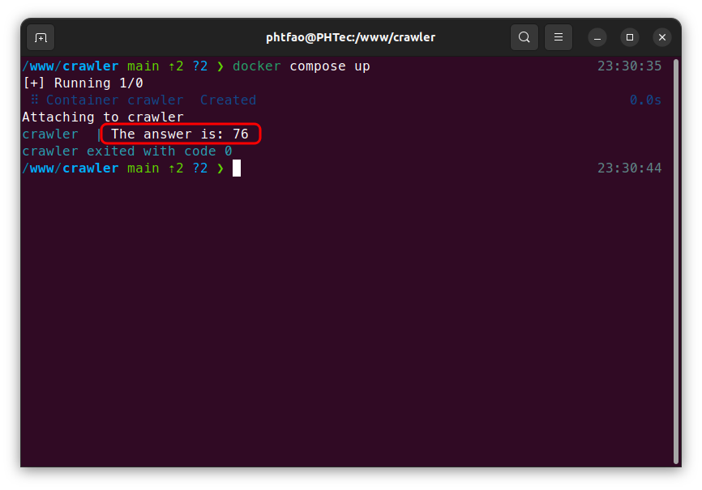

# Desafio CRAWLY

Encontrar “a resposta”, utilizando um crawler. “A resposta" se encontra atrás do clique de um botão, aqui: http://applicant-test.us-east-1.elasticbeanstalk.com/

Você deverá fazer um crawler que emita requisições e leia as respostas, em baixo nível **(sem emuladores de browser, como puppeteer, selenium, phantomjs, jsdom, etc)**.
Esse crawler deve ser capaz de ler “a resposta" produzida e escrevê-la na tela.O teste deve ser feito em PHP. Pode utilizar quaisquer frameworks/bibliotecas que quiser.

- O código deverá ser disponibilizado no Github;
- Deverá conter um Dockerfile ou um docker-compose.yml com as instruções de como executar o código do desafio.
- Pontos extras se o código do desafio acompanhar alguns testes unitários!

O prazo recomendado para envio da resposta do desafio é até 48h do envio desta mensagem.

---
## Tecnologias utilizadas
- PHP 8.1

---
## Requisitos
- Docker
- Docker compose

---
## Execução
Para executar este desafio, basta clonar este projeto

```bash
git clone https://github.com/phtfao/crawler.git
```

E em seguida, dentro do diretório clonado, executar o container:
```bash
docker compose up
```
